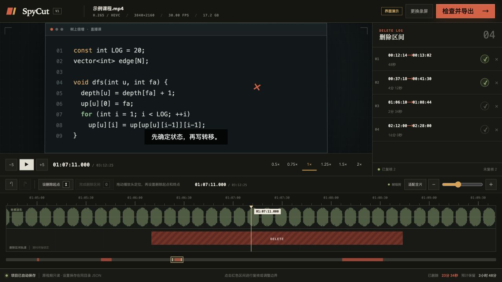
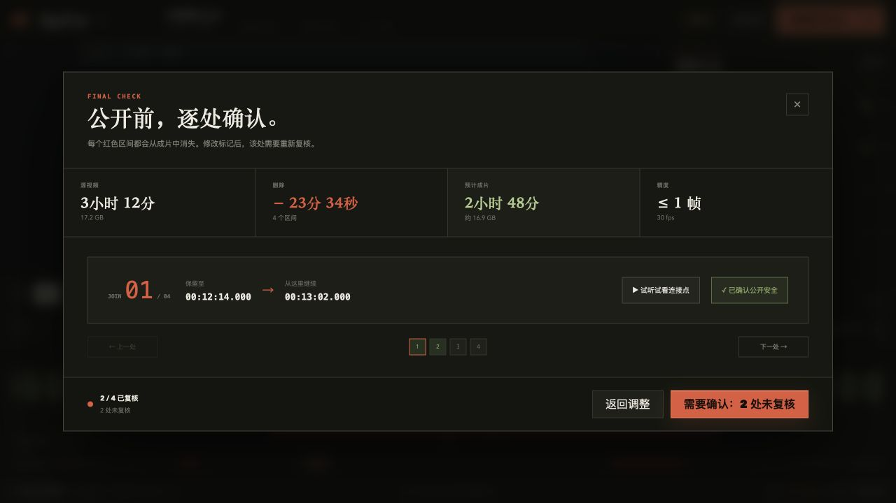
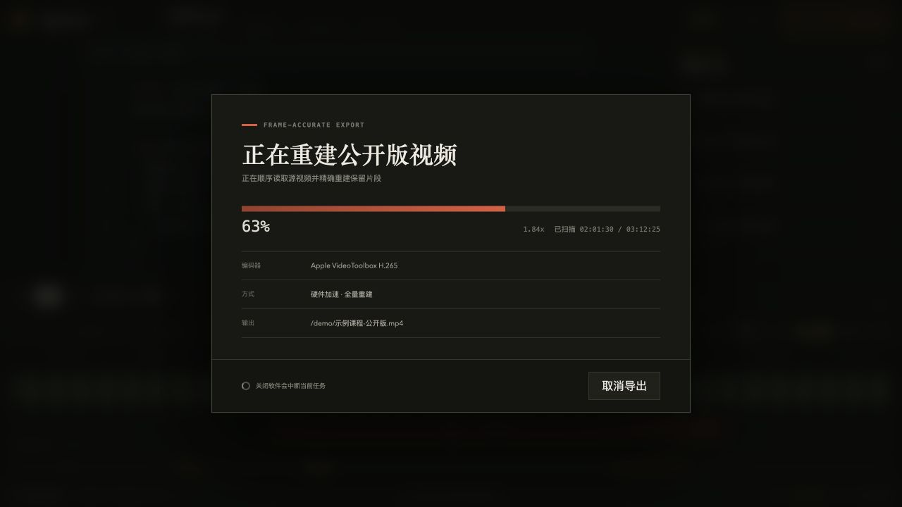

<p align="right">
  <strong>English</strong> · <a href="README.zh-CN.md">简体中文</a>
</p>

<div align="center">
  
  <h1>SpyCut</h1>
  <p><strong>A precision, delete-only editor for long recordings.</strong></p>
  <p>Cut what should not be there. Keep everything else exactly where it was.</p>

  <p>
    <a href="https://github.com/songpy97/spycut/actions/workflows/ci.yml"></a>
    <a href="https://github.com/songpy97/spycut/releases"></a>
    <a href="LICENSE"></a>
    
  </p>

  <p>
    <a href="https://github.com/songpy97/spycut/releases"><strong>Download the preview</strong></a>
    · <a href="https://github.com/songpy97/spycut/issues">Report an issue</a>
    · <a href="CONTRIBUTING.md">Contribute</a>
  </p>
</div>

> [!IMPORTANT]
> SpyCut is an unsigned, unnotarized open-source preview. Windows SmartScreen or macOS Gatekeeper may show a publisher warning. Verify the SHA-256 file shipped with the release before installing. The current application UI is in Simplified Chinese; English UI localization is on the roadmap.



## Why SpyCut exists

Long recordings usually do not need a full nonlinear editor. A three-hour class, webinar, or screen recording often needs only a few things removed: a false start, a break, a private conversation, a failed demo, or a section that should not be published.

Traditional editors make you manage every clip you keep. SpyCut asks you to mark only what you want to remove.

That constraint is the feature:

- the original timeline can never be rearranged;
- the source video is always read-only;
- kept content is the deterministic complement of delete intervals;
- every join can be reviewed before export;
- the final MP4 is rebuilt and validated before it replaces anything.

SpyCut is not trying to replace Premiere Pro, Final Cut Pro, or DaVinci Resolve. It is the focused first pass that makes a long recording safe and clean before publishing or professional finishing.

## Built for real long-form workflows

| Use case | What SpyCut removes |
| --- | --- |
| Online courses and tutorials | Retakes, pauses, breaks, off-topic explanations, private Q&A |
| Webinars and corporate training | Pre-roll setup, internal discussion, confidential segments |
| Product demos and screencasts | Failed attempts, loading time, repeated walkthroughs |
| Coding streams and lecture archives | Dead air, interruptions, accidental disclosures |
| Meetings and community sessions | Sensitive moments that must be reviewed before publishing |
| Professional post-production | A safe rough clean-up before the creative edit begins |

Everything runs locally. SpyCut does not require uploading your recording to a cloud service.

## A deliberately smaller editing model

| Conventional timeline editor | SpyCut |
| --- | --- |
| Move, split, copy, and reorder clips | Mark delete intervals on one immutable timeline |
| Reconstruct what should remain | Preserve everything except explicit deletions |
| Easy to disturb clip order accidentally | Reordering is structurally impossible |
| Export may fail after writing the destination | Encode to a same-disk partial, validate, then commit |
| Review the whole result manually | Review each deletion join in a dedicated flow |

## Workflow

1. **Open a recording** — SpyCut supports H.264/AVC and H.265/HEVC MP4 in V1.
2. **Mark what should disappear** — use the speech waveform, playhead, `I`/`O`, zoom, and frame-snapped handles.
3. **Review every join** — preview three seconds before and after each deletion and confirm that the cut is safe to publish.
4. **Export with confidence** — SpyCut locks an immutable project snapshot, re-encodes the kept timeline, validates the result, and atomically commits the destination.

## Product tour

| Review every deletion join | Supervised, frame-accurate export |
| --- | --- |
|  |  |

The screenshots use SpyCut's built-in synthetic demo. No private course footage, filenames, or user data are included.

## What makes it dependable

- **Immutable source timeline** — intervals can be resized, but clips cannot be moved or reordered.
- **Speech waveform navigation** — find pauses and sentence boundaries quickly without creating a proxy project.
- **Frame-snapped boundaries** — video cuts target source-frame boundaries; focused handles support frame-by-frame adjustment.
- **Deletion-aware preview** — normal playback skips marked regions while explicit manual seeks remain controllable.
- **Join-by-join review** — changed intervals automatically invalidate their previous review state.
- **Transactional export** — the final destination is untouched until encoding and automated acceptance checks succeed.
- **Local-first project files** — edits are saved beside the source as `<full-video-name>.spycut.json`.
- **Large-file preview** — a tokenized loopback HTTP Range server streams only the requested bytes with a fixed 64 KiB buffer.
- **Privacy-aware diagnostics** — logs exclude source paths, filenames, preview tokens, and course content.

## Download and compatibility

Download the latest preview from [GitHub Releases](https://github.com/songpy97/spycut/releases).

| Platform | Package | Status |
| --- | --- | --- |
| macOS 12+ on Apple Silicon | DMG or portable ZIP | Native preview build; locally signed, not notarized |
| macOS 12+ on Intel x64 | DMG or portable ZIP | Native preview build; locally signed, not notarized |
| Windows 10/11 x64 | NSIS installer | Native CI build with install/uninstall smoke test; unsigned |

Release bundles include supervised FFmpeg/FFprobe sidecars, so users do not need to install FFmpeg separately. macOS checksums are published in architecture-specific `SpyCut_*_checksums.txt` files; Windows installers include an adjacent `.sha256` file.

### V1 media scope

- Container: MP4
- Video: H.264/AVC or H.265/HEVC
- Output codec family: preserved from the input
- Main10 input: explicitly confirmed conversion to a more compatible 8-bit output
- Metadata and chapters: removed by default to reduce accidental disclosure

VFR, multiple audio/video streams, non-AAC audio, and 10-bit sources trigger explicit review warnings instead of being handled silently.

## Keyboard shortcuts

| Shortcut | Action |
| --- | --- |
| `Space` | Play / pause |
| `I` or `[` | Mark deletion start |
| `O` or `]` | Mark deletion end |
| `←` / `→` | Seek backward / forward 1 second |
| `Shift` + `←` / `→` | Seek backward / forward 5 seconds |
| `Cmd/Ctrl` + `←` / `→` | Seek backward / forward 30 seconds |
| `J` / `K` / `L` | Slower / pause / faster playback |
| `Cmd/Ctrl` + `Z` | Undo |
| `Cmd/Ctrl` + `Shift` + `Z` | Redo |
| `Delete` | Remove the selected delete interval |
| `Esc` | Cancel an unfinished mark or close review |

When the playhead or an interval handle has focus, arrow keys move by one frame and `Shift` + arrow moves by one second.

## What “frame-accurate export” means here

SpyCut does not use keyframe-only stream copying or mix copied GOPs with re-encoded boundaries. FFmpeg sequentially decodes the complete input, filters frames and audio on the original timeline, and uniformly re-encodes all kept content.

- Video boundaries are snapped to source frames, with a target error no greater than one frame.
- Audio is filtered in 32-sample chunks; at 48 kHz the theoretical boundary granularity is about 0.67 ms.
- The output is checked for stream counts, codec family, start time, duration, A/V drift, and decodability around joins.
- Encoding first targets a hidden same-disk partial file. Cancellation or failure does not pollute an existing destination.

This is slower than stream copy by design. The trade-off is deterministic ordering, consistent codec parameters, and joins that can be validated.

## Architecture

```text
Svelte UI
   ↓ Tauri commands and events
Rust application + domain model
   ↓ supervised media jobs
FFmpeg / FFprobe + local filesystem + loopback Range server
```

The domain layer owns intervals, time, project state, and export plans without depending on Tauri or I/O. Commands enforce project identity and workflow locks. Infrastructure isolates filesystem, media process, preview server, validation, and recovery failures.

Core stack: **Tauri 2 · Rust · Svelte 5 · TypeScript · Vite · FFmpeg**

## Development

Prerequisites are documented by the environment check script and version files in the repository.

```sh
scripts/check-env.sh
pnpm install --frozen-lockfile
pnpm check
pnpm tauri:dev
```

Platform packaging:

```sh
# Native Apple Silicon or Intel macOS: build and verify DMG + ZIP
bash scripts/package-macos.sh
```

```powershell
# Native Windows: build NSIS; add -SmokeTest on a clean machine/VM
./scripts/package-windows.ps1 -SmokeTest
```

Interactive version release:

```sh
bash scripts/release.sh
```

The script prompts for a major, minor, or patch increment, synchronizes the package, Tauri, Cargo, and lockfile versions, runs `pnpm check`, then asks for final confirmation before including every current worktree change in a release commit. If global `pnpm` is unavailable, it uses Corepack or falls back to downloading the repository-pinned `pnpm@11.16.0` temporarily through `npm` (the first npm fallback requires network access). It creates an annotated `v*` tag and atomically pushes `main` plus the tag. That tag triggers native ARM64 macOS, Intel macOS, and Windows packaging; all three must pass before the workflow creates a prerelease. A manual `workflow_dispatch` uploads artifacts but does not create a GitHub Release.

See [AGENTS.md](AGENTS.md) for product invariants, architecture boundaries, and the verification matrix. Detailed V1 architecture and acceptance records currently live in the Chinese [development document](docs/SpyCut-V1-开发文档.md) and [acceptance report](docs/SpyCut-V1-验收报告.md).

## Roadmap

- [x] Immutable delete-only timeline with undo/redo
- [x] Speech waveform and long-recording navigation
- [x] Join review and transactional, validated export
- [x] Native Apple Silicon macOS, Intel macOS, and Windows x64 preview builds
- [ ] English application UI and a maintainable localization layer
- [ ] Signed and notarized public releases
- [ ] Broader real-device media compatibility testing

The roadmap is intentionally conservative. Expanding the input format or editing model requires corresponding probe, UI, export, validation, test, and documentation work.

## Contributing

Bug reports, reproducible media edge cases, documentation improvements, translations, and focused pull requests are welcome. Start with [CONTRIBUTING.md](CONTRIBUTING.md) and read [AGENTS.md](AGENTS.md) before changing behavior.

Please do not attach private recordings, project sidecars, preview URLs, diagnostic logs containing user data, or licensed media fixtures. Minimal synthetic samples are preferred.

If SpyCut solves a problem you recognize, starring the repository helps other educators and creators discover it.

## Security and privacy

Report vulnerabilities through GitHub's private **Report a vulnerability** channel. See [SECURITY.md](SECURITY.md) for details.

## License

SpyCut source code is available under the [MIT License](LICENSE). FFmpeg retains its own license; distribution notices, sources, and build records are documented under [`third-party/ffmpeg/`](third-party/ffmpeg/).

Before commercial distribution, review platform signing/notarization requirements and the H.264/H.265 patent obligations that apply in your jurisdictions.
